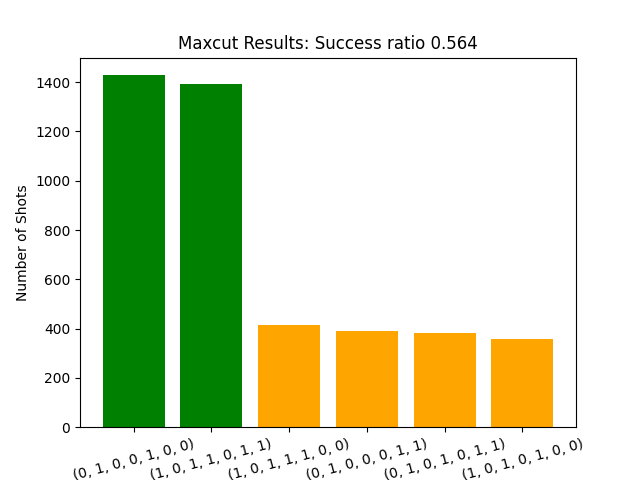
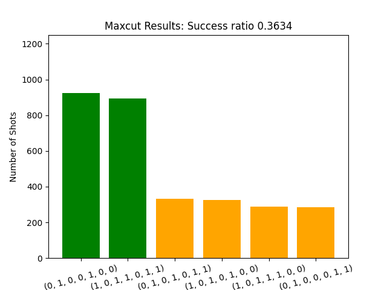

# Neophytes Challange Report

## Challenge 2: Classical Optimization using Stochastic Gradient Descent

The provided code implemented a naive optimization strategy to find the best mixing and cost angles for the MaxCut problem.
In the naive approach, pairs of angles were sampled at random from uniform distributions.
For each pair of angles, the empirical expected value of the Hamiltonian was measured. The angles that yielded the highest expected value of the hamiltonian are returned as best guess.

With the best guess, the MaxCut circuit was run with the `AerBackend`. The success ratio was recorded as the fraction of shots that returned the correct solution to the problem.

The gradient ascent method computes the gradient at every iteration using the `scipy.optimize` method for finite difference approximations. This allows us to direct the parameter search in direction of the steepest increase of the energy surface. 

Gradient Ascent methods are sensitive to the choice of the step size by which the parameter vector is updated and can get stuck in local maxima.
To tackle these challenges, we include a naive 'momentum term'. Instead of simply following the gradient, we include a term that maintains some of the 'momentum' of the previous search direction. With this more sophisticated approach, our classical optimization results in a better success ratio than the naive implementation.

For an optimization with 200 iterations, and 5000 shots, the results are shown in the following table and figures.

|               | Naive  | Neophytes |
|---------------|--------|-----------|
| Energy        | 5.03   | 5.46      |
| Success Ratio | 0.3634 | 0.5640    |

Neophytes results angles

Best Cost Angles: [0.38376821141182077, 0.739944298103698, 0.7692712948168382]
Best Mixer Angles: [0.39408217332547335, 0.25219105619534044, 0.1504924633149269]

